# Introduction

## The Statistics Development Team

We are half of the Statistics Development Team. Our purpose is to challenge and support statisticians to be constantly improving themselves, their processes and their products.

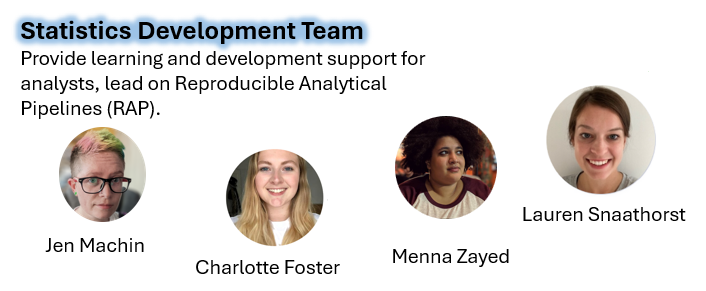{height="12em" fig-align="center"}

We provide learning and development support for analysts and lead on Reproducible Analytical Pipelines (RAP).

## Explore education statistics (EES)

-   [Explore education statistics (EES)](https://explore-education-statistics.service.gov.uk/) was launched in 2020. This is our own statistics publication platform that requires common open data standards for all published data and statistics.

-   EES concentrates on open data standards, whilst also stripping out a large proportion of the typical statistics production process (i.e. formatted Excel tables). The open data is also easily reusable for other services or dashboards.

-   Although our team isn't responsible for EES, we are responsible for encouraging the use of best practice when publishing statistics.

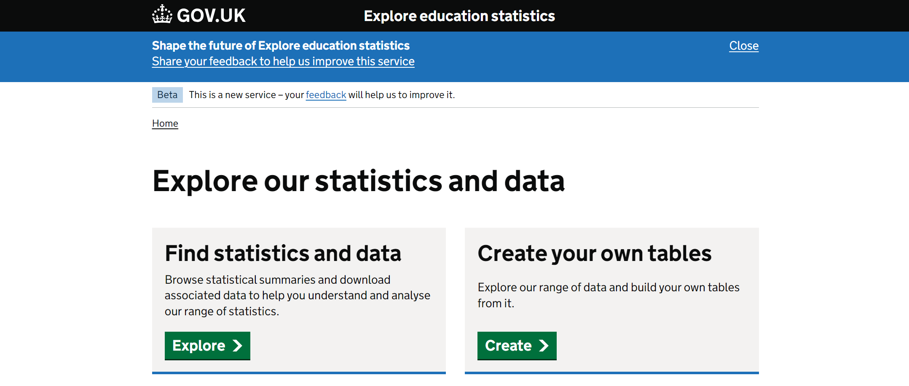{height="12em" fig-align="center"}

## Our L&D offer: Analysts' Guide

The [Analysts' Guide](https://dfe-analytical-services.github.io/analysts-guide/) is our public facing guidance website, including information on:

-   Learning Resources for SQL, R, Git and Databricks
-   Statistics production, including Open Data standards, accessibility, RAP and analytics
-   Writing about data and visualising data, including publication of dashboards
-   Databricks, including the use of notebooks and workflows

Our team owns and regularly updates the site, although we do appreciate contributions from across the department! Having the site means that we can keep guidance consistent across the department, and easily refer people to information that they can implement in their own work.

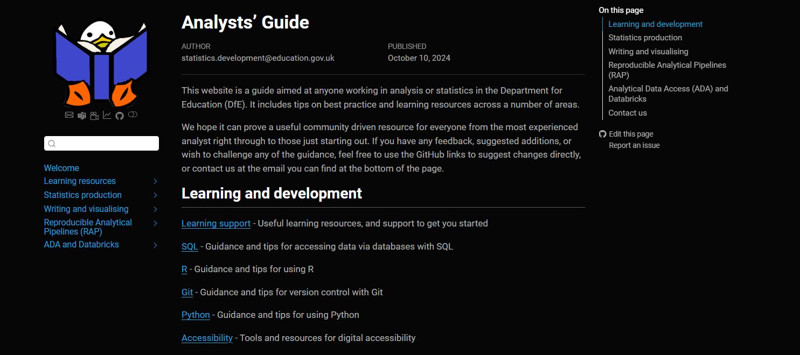{height="9em" fig-align="center"}

## Our L&D offer: Statistician's Guide to the Galaxy

:::::: columns
::: {.column width="50%"}
We run information sessions every 4 weeks for all analysts across DfE, including information on:

-   Upcoming events, courses and L&D opportunities (internal and external)
-   GSS, ONS and OSR updates
-   Volunteering opportunities and surveys
-   Updates to our DfE packages (dfeR and dfeshiny) and the Analysts' Guide
-   Recent statistics publications and dashboard analytics
-   Tips on R, Git, helpful websites and how to use EES

People across the unit contributes to the slides and the presentation itself
:::

::: {.column width="10%"}
:::

::: {.column width="40%"}
    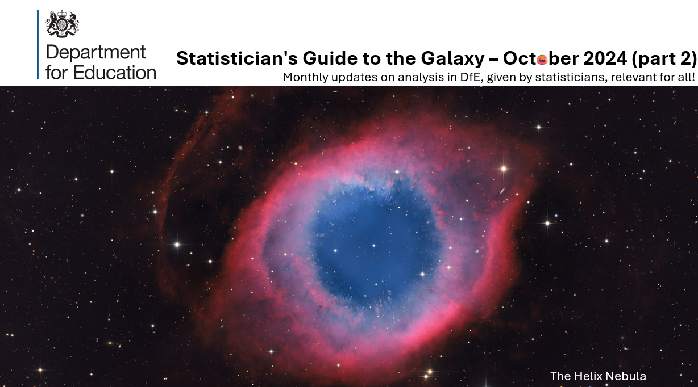
:::
::::::

## Our L&D Offer: AI Knowledge Shares

:::::: columns
::: {.column width="70%"}
Every month we facilitate an AI knowledge-share series. These are hour-long sessions where 2-3 volunteers come each month to share the work they've been doing that involves AI (it can be literally anything!). The point is to increase awareness and build connections in the department. 

We have both internal & external volunteers, and invite the entire analytical community. Volunteers will present their work with ample time after for questions/discussion. 

Some examples of presentations we have seen are:

- AI Case Study on Employer Engagement, *The Apprenticeship Service, DfE*
- Automatic triage, *The HMT transformational team*
- Using generative AI to improve job descriptions & Identification of gendered language in job descriptions using NLP, *Government People Group, Cabinet Office*

We also cover all updates on AI-related guidance both within DfE and the wider civil service. 
:::

::: {.column width="10%"}
:::

::: {.column width="20%"}
  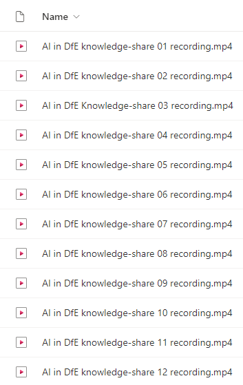
:::
::::::

# Quality Assurance in DfE

## QA using the EES data screener

::::: columns
::: {.column width="70%"}
{width="80%"}
:::

::: {.column width="30%"}
-   Before being uploaded to EES, data must be run through an [internal data screener app](https://rsconnect/rsc/dfe-published-data-qa/), which runs more than 80 pre-set QA checks on the files

-   The screener runs a multitude of automated tests against the data files, including checks on file names, content of metadata files, and comparisons against ONS geographies

-   The code for the data screener is [available on GitHub](https://github.com/dfe-analytical-services/dfe-published-data-qa)
:::
:::::

## QA Standards

In DfE, we currently consider three principles of quality when completing QA:

-   Does the ***data*** make sense?

-   Does the ***process*** make sense?

-   Does the ***story*** make sense?

 

This is driven by four enablers:

-   **Plan**: have a plan for QA and extra plans for new content or data, organising external review, using lessons learnt to inform continuous improvement

-   **Automate**: make use of automated QA in publications

-   **Document**: internal and external methodology documentation, version control, code comments, readme files

-   **Manage change**: risk assessments and risk logs, assessing impact of revisions, getting sign off on changes

## QA Week

:::::: columns
::: {.column width="50%"}
  Earlier this year, there was a divisional QA week in which we had speakers on a variety of topics, including:

-   The Quality Framework
-   QA resources
-   Cross-team peer review
-   Documentation and building resilience
-   Data cleaning
-   Automated QA examples
:::

::: {.column width="10%"}
:::

::: {.column width="40%"}
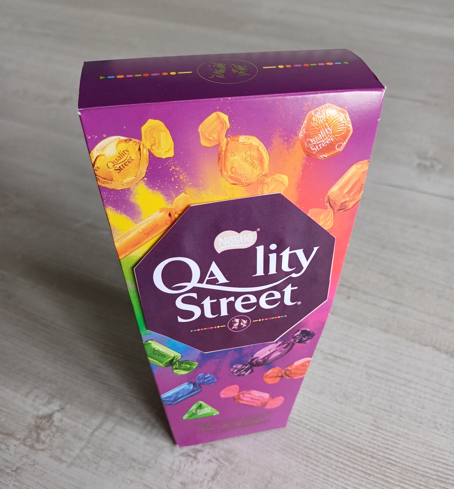{width="80%"}
:::
::::::

# RAP in DfE

## Internal RAP standards (good, great and best)

::::: columns
::: {.column width="60%"}
    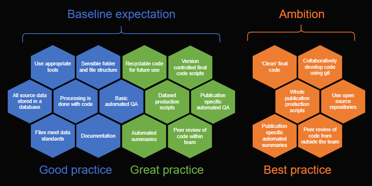{width="90%"}
:::

::: {.column width="40%"}
    In DfE we have our own internal RAP standards of good, great and best practice based on what we know about the analysts and the work in our department. All of the guidance is available on our public [DfE analysts' guide site](https://dfe-analytical-services.github.io/analysts-guide/).

All analysts working on statistics publications are expected to be working towards these standards.
:::
:::::

## Assessing RAP levels for statistics publications

  

:::::: columns
::: {.column width="60%"}
-   Initially, teams completed RAP development plans for each of their publications, indicating which elements of RAP were still outstanding, any help they needed, and deadlines for meeting each RAP principle

 

-   Teams are also encouraged to regularly update our internal RAP self-assessment app to track their progress

 

-   When a team meets our baseline standard (all elements of Good + Great practice), they are audited by us
:::

::: {.column width="10%"}
:::

::: {.column width="30%"}
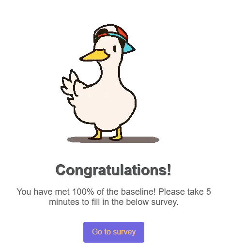{width="100%"}
:::
::::::

## Self-assessment tool

:::: columns
::: {.column width="100%"}
-   [Internally hosted R Shiny app](https://rsconnect/rsc/publication-self-assessment/) for statistics publication teams and team leaders to assess progress towards Good, Great and Best RAP standards.

-   Teams are encouraged to update their self assessments regularly

-   Recently added a progress monitoring tab for individual publications and G6s.

-   Can also use it to identify teams that might need guidance and targeted support

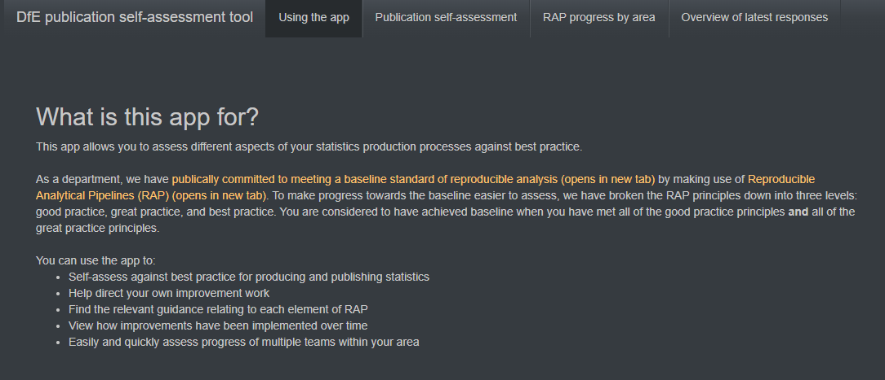{fig-align="center"}
:::
::::

## RAP Knowledge Shares

To boost awareness, last year I ran the DfE RAP knowledge-share series. Using information from the self-assessment tool, I planned a series which focused on a new topic each month, with 2-3 volunteers speaking in each session to show their own examples of good, great and best practice!

:::::: columns
::: {.column width="33%"}
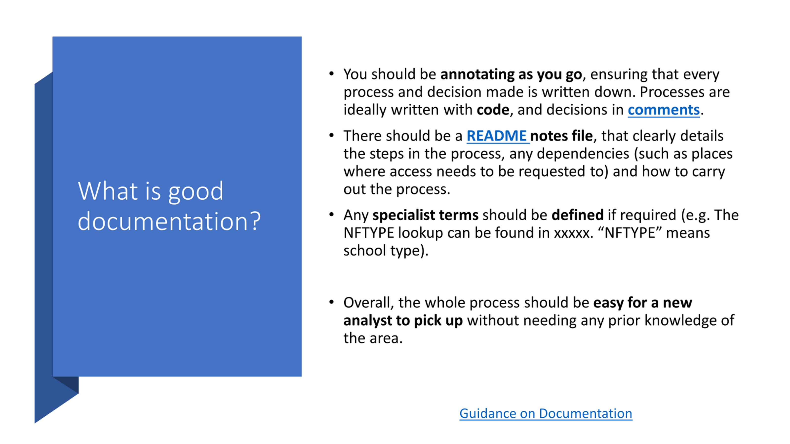{height="8em"} 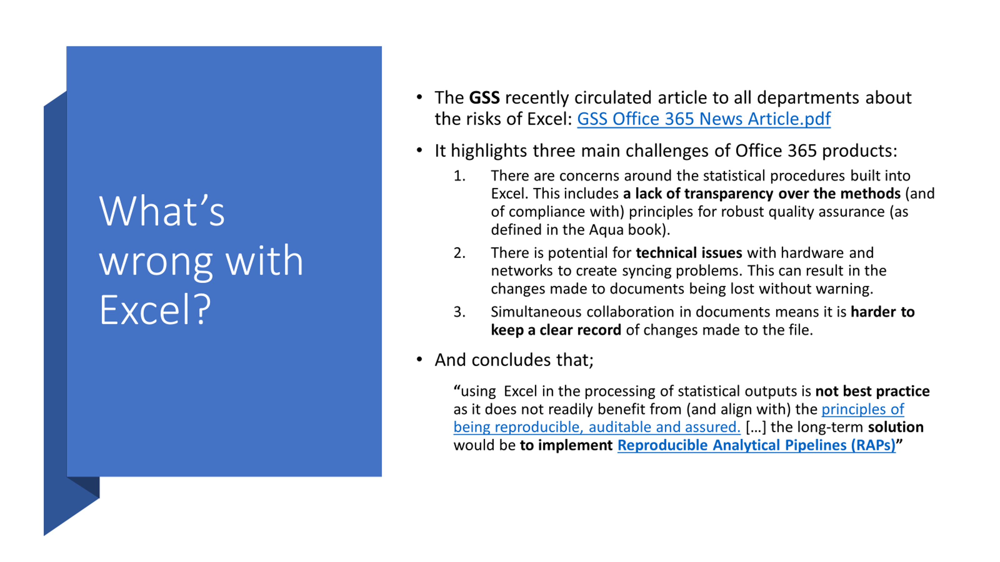{height="8em"}
:::

::: {.column width="33%"}
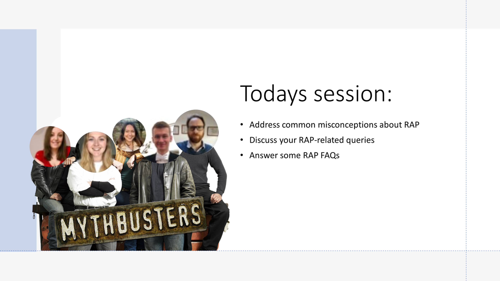{height="8em"} 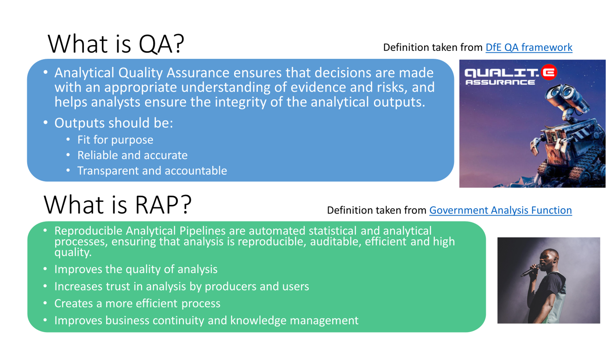{height="8em"}
:::

::: {.column width="33%"}
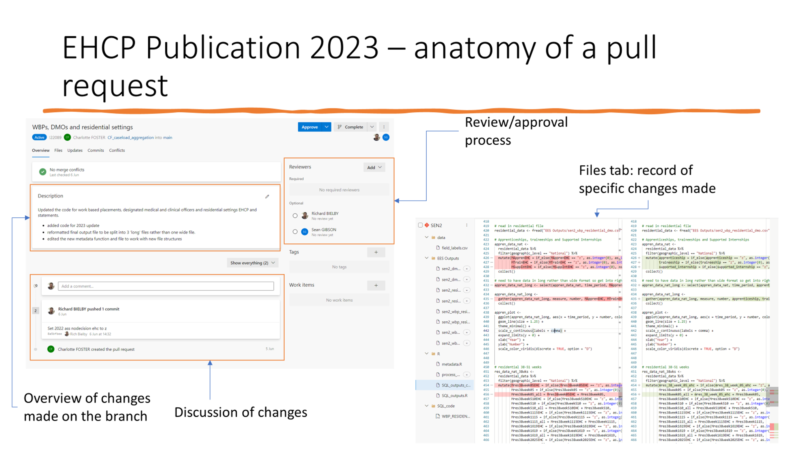{height="8em"} 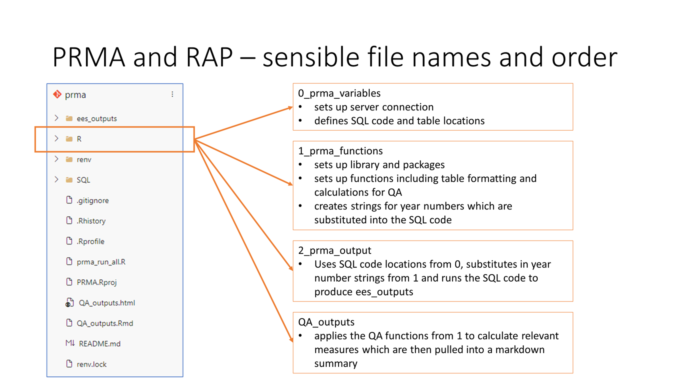{height="8em"}
:::
::::::

## RAP survey

:::::: columns
::: {.column width="60%"}
-   Department-wide survey
-   135 responses
-   All analysts of any profession eligible to respond
-   Responses for each area analysed by their RAP Champion (more on that coming up!)
-   Used to work out how to move forward with implementation
:::

::: {.column width="10%"}
:::

::: {.column width="30%"}
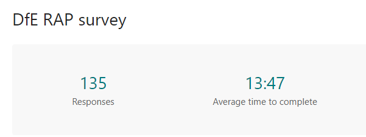{fig-align="right"}

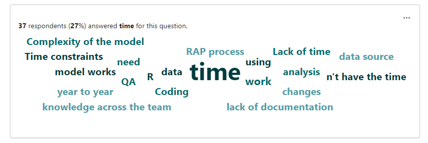{fig-align="right"}
:::
::::::

## Champions network

:::::: columns
::: {.column width="50%"}
-   We currently have 20 RAP champions across the department
-   Varying professions and based across different groups/areas
-   Not all champions work in areas with statistics production teams
-   Monthly meetings for discussions about progress, presenting results, knowledge sharing and training so we can work towards a shared goal
-   All champions have the opportunity to input into next steps
:::

::: {.column width="10%"}
:::

::: {.column width="40%"}
[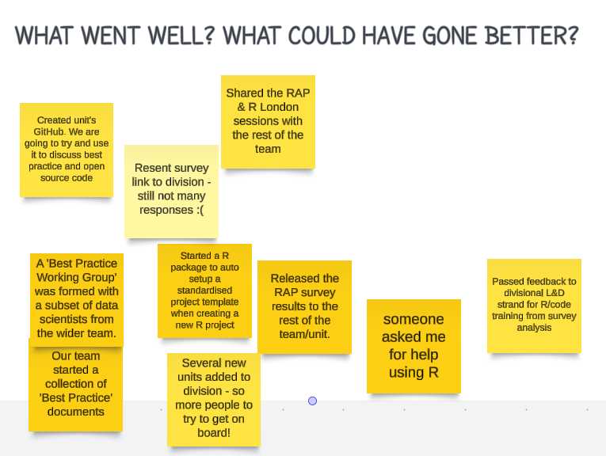{fig-align="right" height="10.2em" width="13.2em"}]() [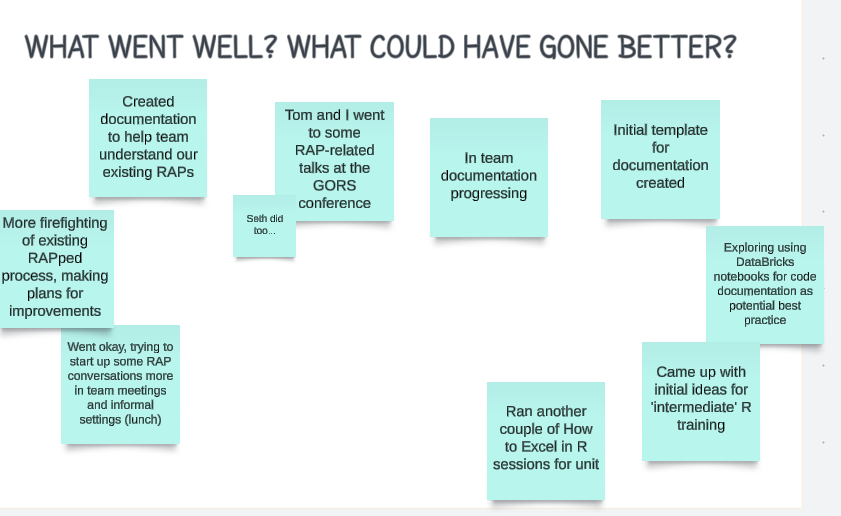{fig-align="right" height="9.2em" width="13.2em"}]()
:::
::::::

## Freestyle RAP sessions

:::::: columns
::: {.column width="50%"}
-   Started as a result of RAP survey responses and suggestions from champions
-   Monthly drop-in sessions for people to ask for RAP help
-   Loads of varied questions!
-   Any analyst can join
-   Each month we have a different RAP champion involved to build skills
:::

::: {.column width="10%"}
:::

::: {.column width="40%"}
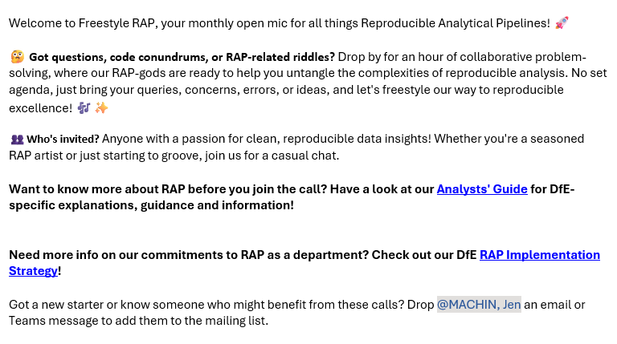{fig-align="right"}
:::
::::::

## Implementation plan

-   Worked with a working group within the DfE to plan the future of RAP in DfE against the [cross-government RAP strategy](https://analysisfunction.civilservice.gov.uk/policy-store/reproducible-analytical-pipelines-strategy/).
-   Ensured the group had a variety of analytical areas and professions.
-   The DfT was the inspiration for ours! We liked how it laid out the goals from the strategy next to the department's planned actions/activities.
-   This also gave RAP visibility with the SLT, and I had meetings with them to discuss the draft before it was published.

The DfE published our [RAP implementation plan](https://analysisfunction.civilservice.gov.uk/support/reproducible-analytical-pipelines/departmental-rap-plans/dfe-rap-strategy-implementation-plan-2023/) at the end of 2023.

## Where we are at & future plans

:::::: columns
The implementation plan, combined with everything else outlined, has helped us assess where we are at now and where we want to go.

::: {.column width="40%"}
### So far

-   All publication teams know our internal standards and have written and submitted a plan to meet them
-   We have generated lots of L&D resources and only plan to expand on that
-   We have started an internal RAP champions network
-   We've strengthened link between the DfE QA network and the DfE RAP network
:::

::: {.column width="10%"}
:::

::: {.column width="40%"}
### Future plans

-   Continue to increase the number of teams meeting and exceeding our baseline!
-   Improve relations with data and IT colleagues (ADA & Databricks)
-   Improve existing guidance to cover more areas of analysis
-   Build a self-assessment app for wider use across the analytical community
-   Continue to improve SLT engagement, sending regular updates to leaders about RAP in their areas.
:::
::::::

## Hints and tips

:::::: columns
::: {.column width="60%"}
-   Build an internal champions network!
-   Have a clear argument for WHY we're doing this
-   Get line managers on board
-   Make communications fun and engaging (emojis work well)
-   Focus on RAP as proportionate to the project
-   If teams are overwhelmed, encourage focus on one element at a time
-   Keep best practice examples to share
-   Make what you're doing as visible as possible
-   Have your own internal standards
-   Use RAP as best practice guidance rather than a binary
:::

::: {.column width="10%"}
:::

::: {.column width="30%"}
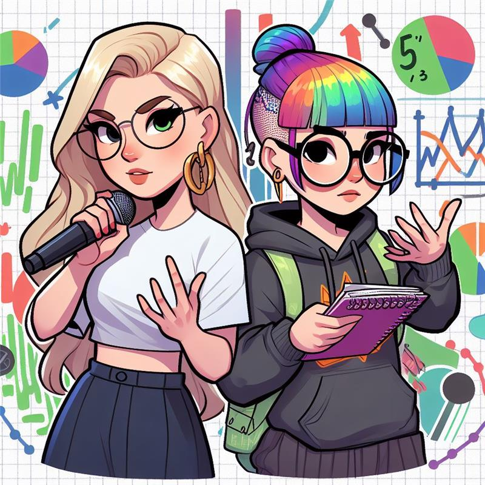{fig-align="right"}
:::
::::::

## Thanks for listening!

:::: columns
::: {.column width="100%"}
Any questions?
:::
::::
